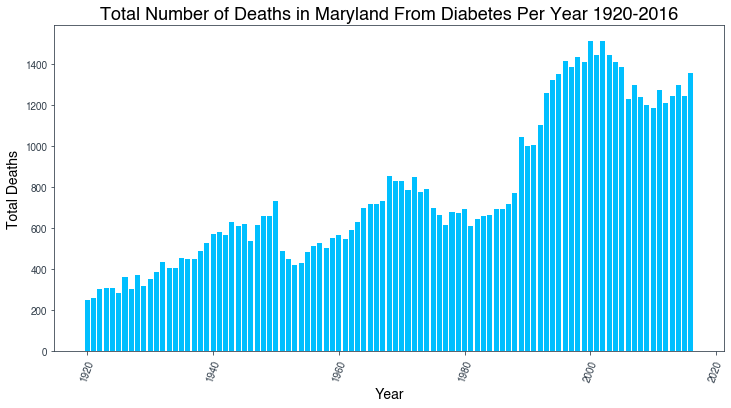

# 
 Exploring risk factors of Diabetes
 <pre>
Contrubuter  : Sandeep Bansal
</pre>

<pre>
Languages    : Python
Tools/IDE    : Anaconda
Libraries    : pandas, matplotlib, numpy, sklearn, seaborn
</pre>

<pre>
Assignment Submitted     : October 2020
</pre></b>
---

## Project Overview
---
- <b>Data</b> - Two datasets were used for modeling and reference. 
  - The raw dataset can be found on the Kaggle website, [here](https://www.kaggle.com/uciml/pima-indians-diabetes-database). 
  - The Maryland Dataset can be found [here](https://opendata.maryland.gov/Health-and-Human-Services/Number-of-Diabetes-Deaths-among-Maryland-Residents/smru-f5wc)
- <b>Research</b> 
  - Emma Wilmot Department of Diabetes & Endocrinology & Iskandar Idris Royal Derby Hospital and Division of Medical Sciences & Graduate Entry Medicine, University   of Nottingham Title: "Early onset type 2 diabetes: risk factors, clinical impact and management" can be found 
  [here](https://journals.sagepub.com/doi/full/10.1177/2040622314548679)
  - Smith, J.W., Everhart, J.E., Dickson, W.C., Knowler, W.C., & Johannes, R.S. (1988). Using the ADAP learning algorithm to forecast the onset of diabetes mellitus. In Proceedings of the Symposium on Computer Applications and Medical Care (pp. 261--265). IEEE Computer Society Press.
- <b>Buisness Objective </b> - Using Logistic Regression can a machine learning model accurately predict whether or not the patients in the dataset have diabetes or not?

## Abstract and Introduction:
---
#  
 
## Motivation and Buisness Objective: 
# 
 

---
  
 
## Data Dictionary:
| Column Name              | Description                                                          |
| -------------            |-------------                                                         | 
| Pregnancies              | Number of times pregnant                                             | 
| Glucose                  |Plasma Glucose level Oral Glucose Test                                |  
| Blood Pressure           | Diastolic Blood pressure in mmHg                                     | 
| Skin Thickness           | Triceps skin fold thickness in mm                                    |   
| Insulin.                 | 2-Hour insulin level in mU/ml                                        |
| BMI                      | Body Mass Index in Kg                                                |
| Diabetes Pedagree Func.  | Diabetes Pedigree Function                                           |
| Age                      | Age (years)                                                          |
| Outcome                  | Class Variable (0 or 1)                                              |

---
## Proposed Method of Modeling
---
## Experiments
---
## Results and Primary Findings
---

## Research and Related work
---
## Discussion
---
## Conclusion and summary
---
## Limitations and Future work.
---
## References and contributions
